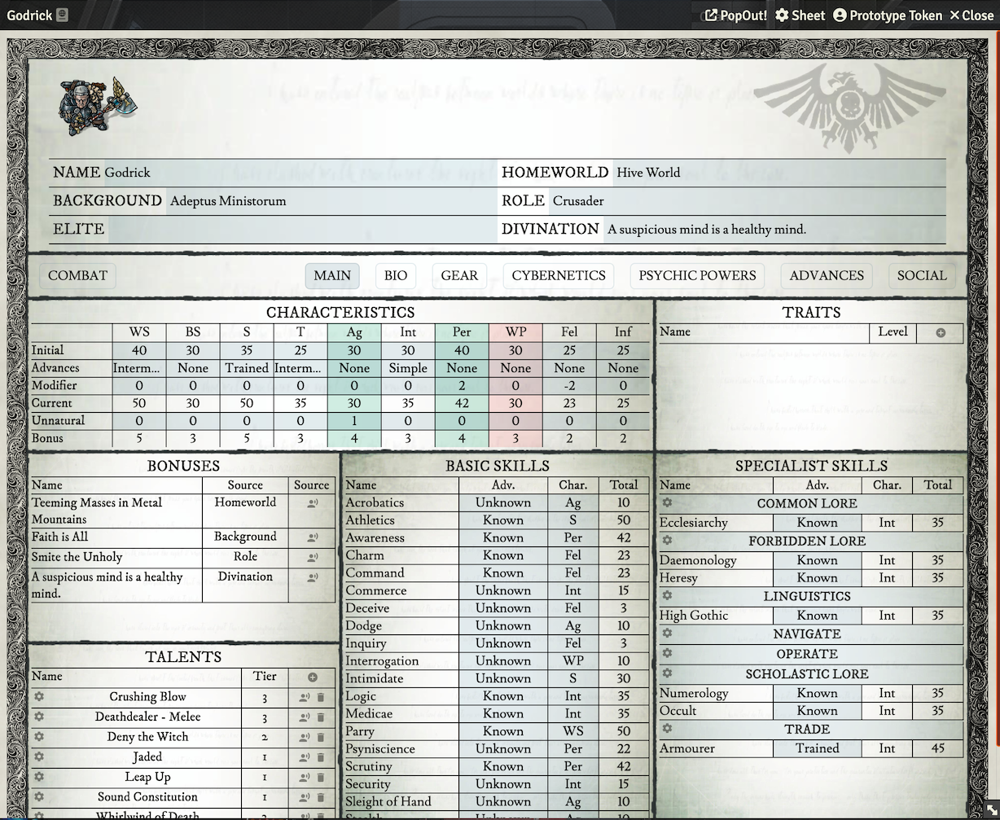
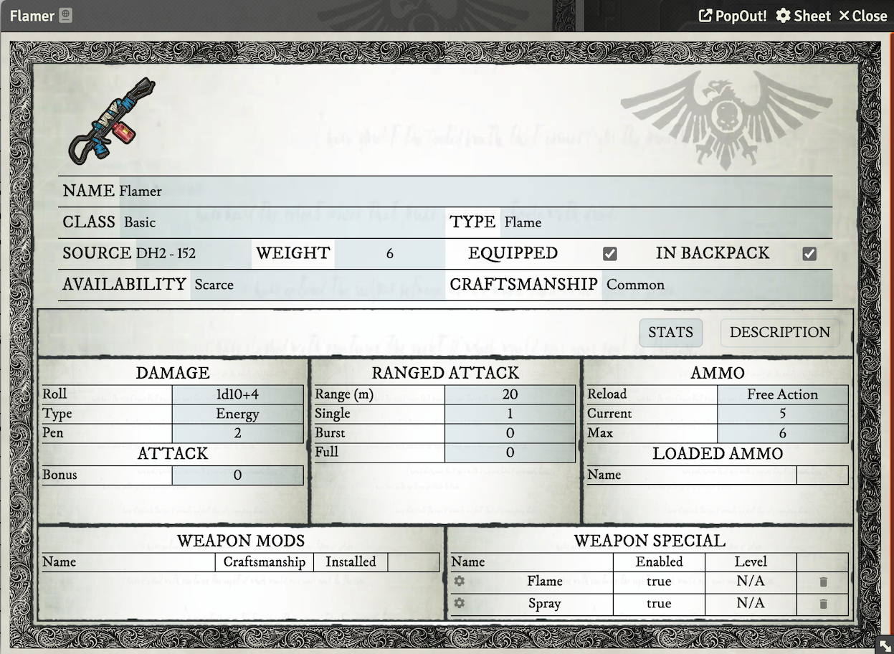
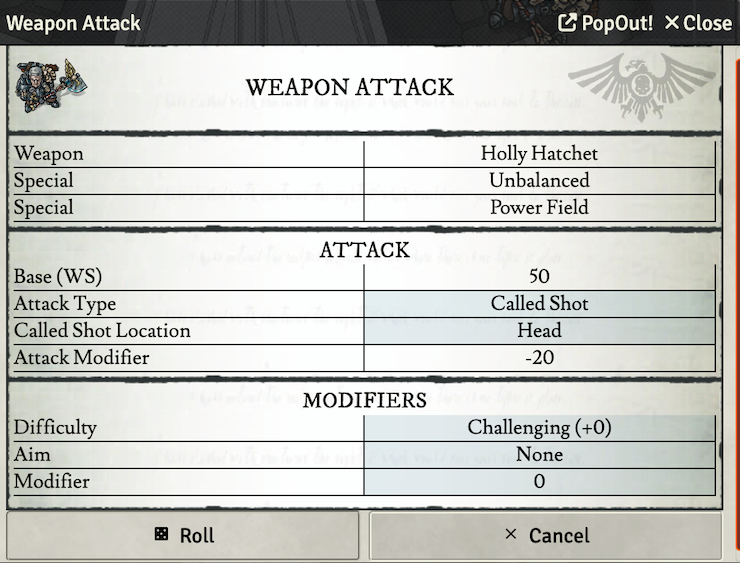
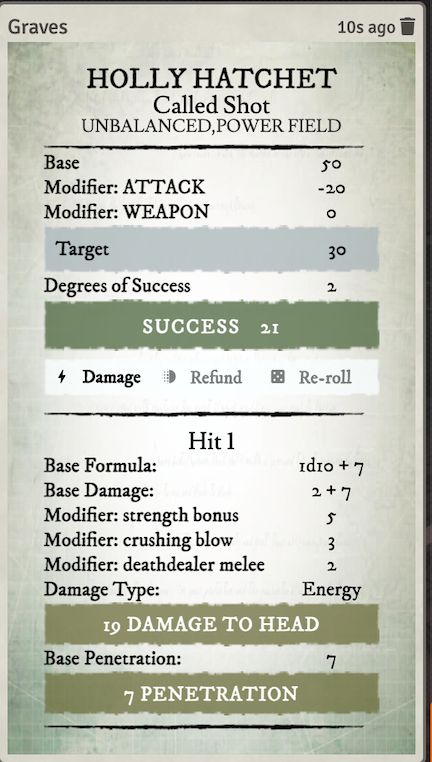

# Dark Heresy 2nd Edition: Expanded

An _unofficial_ system for playing Dark Heresy 2nd Edition on [Foundry VTT](https://foundryvtt.com/), built on [Matt Keathley's Dark Heresy 2nd Edition system](https://github.com/mrkeathley/dark-heresy-2nd-vtt) and extended with further automation.

It gives you full character sheets, a large set of compendium packs, and automation that handles the bookkeeping so the table can stay on the fiction — attack resolution with weapon qualities, ammunition and modifiers applied for you, background and role bonuses during character creation, and encumbrance and inventory that keep themselves straight.

This fork adds the layer above that: gear whose effects genuinely change your character, consumables you can use, situational bonuses shown on the roll they apply to rather than left in the item text, and a Requisition menu that runs the Influence test for you. See [Added in this fork](#added-in-this-fork) for the full list.

**Requires Foundry v13 or later.** Verified against 14.365.

---

## Credits

**The Dark Heresy 2nd Edition system for Foundry VTT was created by [Matt Keathley](https://www.keathley.co)** — [mrkeathley/dark-heresy-2nd-vtt](https://github.com/mrkeathley/dark-heresy-2nd-vtt). The character sheets, compendium packs, roll pipeline, combat automation and essentially all of the architecture this fork builds on are his work, and it is excellent. If you want the system as its author intended, install the original rather than this fork.

This fork is maintained by [Matt Mavis](https://github.com/MattMavis) and adds further automation for my own table. The _Thanks_ section at the bottom is the original author's own acknowledgements, kept as he wrote them; the sections marked **Added in this fork** describe what I have added on top of his work.

Released under the same [GPL v3.0](https://choosealicense.com/licenses/gpl-3.0/) licence as the original.

### A disclaimer worth reading first

I'm a programmer, but not in the language Foundry is written in, and I don't know its API. The additions in this fork were built with [Claude Code](https://claude.com/claude-code) doing the implementation while I directed the design, tested it against a real campaign world, and decided what the rules should actually do.

What that means in practice:

- Everything here was verified against a live world before being committed, including numeric before/after comparisons across every character to check that changes didn't quietly alter existing sheets.
- The system ships **data migrations**. They keep a backup of the data they convert, but as with any system update, **back up your world before installing**.
- If something breaks, please open an issue rather than working around it by hand. I'd rather fix the cause.
- Don't assume the code follows Foundry community idioms. It works and it's tested, but it was written by someone learning the platform as they went.

---

## Features

🗡️ The system includes a variety of compendium packs, such as weapons, weapon mods, talents, armor, psychic abilities, ammunition, tools, traits, attack specials (toxic, corrosive, etc.), and consumables and drugs.

💪 During character creation, there are automated bonuses for backgrounds, roles, and elite advances.

🧰 You can easily manage your inventory by dragging and dropping items, such as weapon mods and custom ammunition to build weapons, or storing items in a location on your ship to reduce encumbrance.

🔫 You can also drag weapons and skills to the macro bar for easy access, and the system offers automation support for weapon specials, most talents, attack types, and custom ammunition when you attack. Modifiers like distance and character size are automatically taken into account when targeting an attack.

## Added in this fork

⚡ **Gear that actually changes your character.** Items can carry Active Effects that modify characteristics, skills, specialist skills and armour. Equip a Medi-kit and your Medicae goes up; take it off and it goes back down. Effects apply only while the item is equipped, and things inside a weapon only count while that weapon is in hand.

💊 **Consumables and drugs you can use.** Stimms, de-tox and the like have a quantity and a Use button. Using one rolls its duration, applies its effects for that long, spends a dose, and posts the result to chat.

📦 **Quantities and stacking.** Physical items have a quantity rather than needing one document per copy. Carry weight counts the whole stack, and requisitioning something you already own adds to it instead of creating a second row.

🎯 **Situational bonuses shown where they matter.** A great deal of equipment grants a bonus only in specific circumstances — "+30 to Security when opening locks", "+20 Toughness to resist gas". Rather than applying these blindly, the system shows them on the relevant roll with the condition spelled out and the number the target *would* become, leaving the call to you.

🏷️ **Talents and traits with a specialisation.** Peer, Enemy, Hatred, Resistance, Weapon Training and Unnatural Characteristic let you pick what they were taken for. The choice sets the item's name, the bonus it advises, and — for Unnatural Characteristic — which characteristic is actually raised. Ratings scale properly, so Peer at rank 2 advises +20.

📈 **Experience kept as a history, not a number you edit.** Spending and awards are both recorded as entries, and the totals are derived from them — so what the sheet says and what you have actually bought cannot drift apart. The Experience panel shows both histories, with a GM-only delete per row.

🛒 **Spend Experience.** A player-facing window prices every characteristic, skill, speciality and talent against that character's own aptitudes, and will not let them skip a rank. Talent prerequisites are read from the talent itself and checked against the character, so the list shows what they qualify for at a glance — though anything the system cannot make sense of stays advisory rather than blocking a purchase, and the GM can override the check entirely.

🎁 **Award Experience.** GM-only, to a single character or the whole party at once, with a reason recorded and the recipients named before you confirm.

🧭 **Character creation wizard.** Eight steps on the Bio tab: home world, background, role, characteristics, aptitudes, starting experience and divination. It grants what your choices entitle you to — aptitudes, skills, talents, traits and starting equipment — rather than leaving you to add each by hand, and anything it cannot find in the compendiums is listed on the summary for you to add yourself instead of being dropped silently. Nothing is written to the character until you press Confirm on the last step.

💰 **Requisition Menu and Warband Subtlety.** A player-facing menu browses available gear by Availability, rolls the Influence test for you, and grants items on success. A shared Warband Tracker holds the party's Subtlety, spent automatically for scarce requisitions.

🩸 **Critical damage automation.** Critical results apply their mechanical consequences — Fatigue, Stunned, Prone, Blinded, Blood Loss, death — with one click, and log a permanent injury record. The genuinely conditional and branching results stay as prose on purpose.

💫 **Status effects that affect dice.** Stunned, Prone and Blinded have real numeric consequences on rolls and action availability rather than being cosmetic icons.

📚 **Filled-out compendiums.** Kit that the books describe as several distinct things but the packs held as one generic entry has been split out properly — the five mechadendrite patterns (utility, manipulator, medicae, optical and ballistic) are now separate items rather than a single "Mechadendrite", and odds and ends like Lho-Stubs have been added alongside their more common cousins.

🔧 **Under the hood.** Ammunition and weapon modifications are real items on a character instead of data hidden inside the weapon, which is what lets them carry effects at all. Cybernetic armour points now reach the character, carry weight counts what's loaded inside a weapon, and a cancelled drag no longer destroys the item being dragged.

## Install

**Back up your world first.** This fork ships data migrations that convert existing content on first load.

This fork:
 - Go to the setup page and choose _Game Systems_.
 - Click the _Install System_ button, and paste in this manifest link:
   `https://github.com/MattMavis/dark-heresy-2nd-vtt/releases/latest/download/system.json`
 - Create a Game World using the "Dark Heresy 2nd Edition" system.

Both this fork and the original share the system id `dark-heresy-2nd`, so Foundry treats them as the same system — install one or the other, not both. The id is deliberately unchanged so that worlds built on the original open with this fork without modification; only the displayed title differs, and it will appear in Foundry as **Dark Heresy 2nd Edition: Expanded**.

The original, unmodified system by Matt Keathley:
 - Manifest: `https://s3-keathley.nyc3.digitaloceanspaces.com/dark-heresy-2nd/system.json`

### Releasing (notes to self)

`npx gulp build` writes `archive/dark-heresy-2nd-<version>.zip`. Publish a GitHub release tagged `v<version>` with both that zip and the built `system.json` attached. The `manifest` URL always resolves to the newest release, while `download` is pinned per release — so bump `version` and the version in `download` together in `src/system.json` before tagging.

Both assets matter: Foundry reads `system.json` from the release to discover the update, so a release with only the zip leaves everyone on the previous version.

**Do not bump the version with `npm run version` on Windows.** The script is written for a POSIX shell; under PowerShell `$npm_config_next` never expands and the literal string is written into both files as the version. Use `npx json -I -f <file> -e "this.version='X.Y.Z'"` on `src/system.json` and `package.json`, and update `download` by hand — the script does not touch it.

`displayReleaseNotes` shows only the case matching the target `worldVersion`, not every version in between, so the notes for a new `worldVersion` need to describe the whole release rather than just its own migration step.

## Links
  - [Foundry VTT](https://foundryvtt.com/)
  - [Dark Heresy 2nd Edition Rules](https://www.drivethrurpg.com/browse/pub/54/Cubicle-7-Entertainment-Ltd/subcategory/179_21610/Dark-Heresy-Second-Edition)
  - [Upstream project](https://github.com/mrkeathley/dark-heresy-2nd-vtt)

## Screenshots

|    |  |
|:---------------------------------------------|:---:|
|   |  |

### Thanks, from the original author
_Matt Keathley's acknowledgements from the upstream project, kept as he wrote them._

- I liked the layout of the WH4e sheet on Roll20 and tried to mimic that where possible. Thanks to the authors for that inspiration.
- I studied the original DH2e Foundry VTT project by moo-man. I ended up not using much from there but learned a lot about Foundry. I appreciate the head start!
- My tabletop group for play testing and feedback.

## License
[GNU General Public License v3.0](https://choosealicense.com/licenses/gpl-3.0/)
